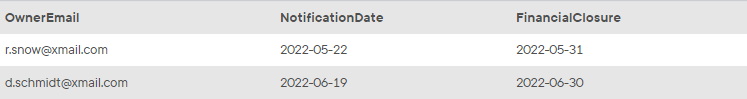

## Task 6:

The InstantStay Owner Relationships team wants to send reminders to the owners that left the system. Collect the email address of the owners, notification date as one week later of their leave and last day of the month for financial closure:

```mysql
SELECT
    OwnerEmail,
    DATE_ADD(OwnerEndDate, INTERVAL 1 WEEK) AS NotificationDate,
    LAST_DAY(OwnerEndDate) AS FinancialClosure
FROM
    OWNER
WHERE
    OwnerEndDate IS NOT NULL;
```

This statement will return email address and notification dates as follows:
<p align='center'>

</p>

<sup>_Owners left the system_</sup>
