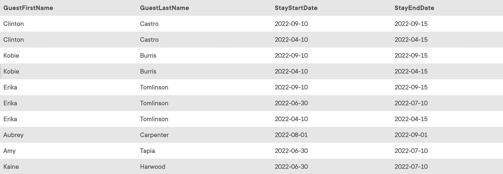

## Task 1:

The local authorities require all the guest information, such as their first and last name and their stay start and end dates, without checking the existence of reservation data:

```mysql
SELECT
    GuestFirstName, GuestLastName, S.StayStartDate, S.StayEndDate
FROM
    GUEST G
        LEFT JOIN
    STAY S ON S.GuestID = G.GuestID;
```

It is expected to get all guests some of which have no reservation date:

<p align='center'>

</p>

<sup>_Combination of all guests and stays_</sup>
