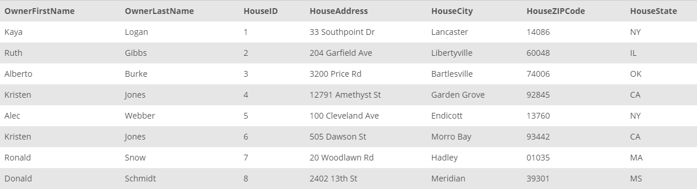

## Task 2:

The InstantStay Legal team requires all house owner's first and last names along with their house ids and addresses. Collect the information from `HOUSE` and `OWNER` tables and return in a consolidated way:

```mysql
SELECT
    OwnerFirstName,
    OwnerLastName,
    HouseID,
    HouseAddress,
    HouseCity,
    HouseZIPCode,
    HouseState
FROM
    HOUSE
        JOIN
    OWNER USING (OwnerID);
```

This statement returns the house information combined with their owners:
<p align='center'>

</p>

<sup>_House and owner data_</sup>
