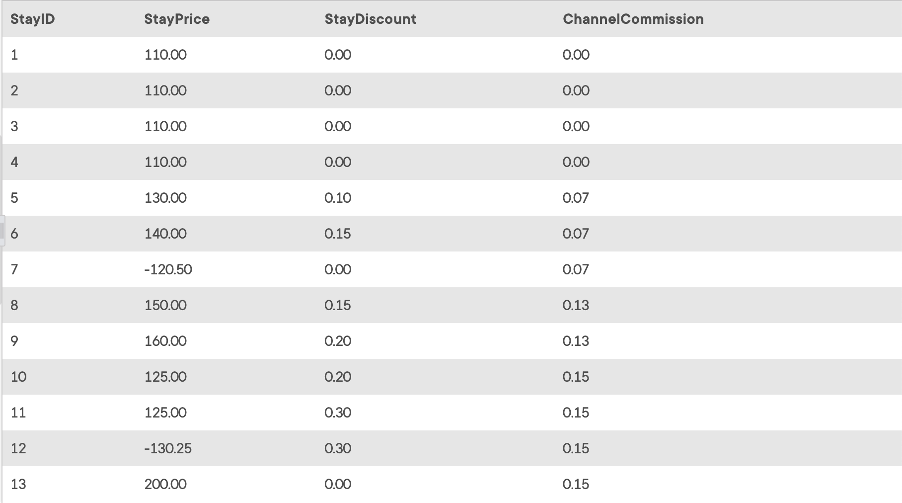

## Task 3:

The InstantStay Finance team wants to collect all Stay IDs with the price, discount and channel commission rate:

```mysql
SELECT
    StayID, StayPrice, StayDiscount, ChannelCommission
FROM
    STAY
        JOIN
    CHANNEL ON STAY.ChannelID = CHANNEL.ChannelID;
```

The statement returns stay information with their price, commission and discount values:
<p align='center'>

</p>

<sup>_Reservations with price, discount and commission_</sup>
