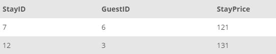
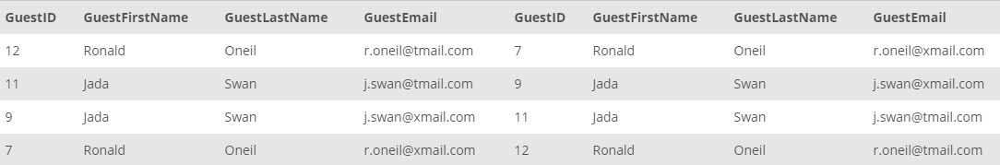

## Task 4:

In a case wherein guests are canceling the reservations or altering their stay days, the respective reimbursements and cancellations payments are reflected with negative prices in the reservation tables. The InstantStay Finance team requires the list of Stay IDs, GuestIDs, and the positive dollar amount rounded up to the nearest whole number:

```mysql
SELECT
    StayID, GuestID, CEIL(ABS(StayPrice)) AS StayPrice
FROM
    STAY
WHERE
    StayPrice < 0;
```

The results you send to the Finance team should look like the example shown below:

<p align='center'>

</p>

<sup>_Canceled or altered stays_</sup>

## Task 5

During the guest user analysis, developers realized there could be duplicate users in the system. Check for the guests with the same name but different GuestIDs to check whether they are duplicate or not:

```mysql
SELECT
    *
FROM
    GUEST G
        JOIN
    GUEST H ON G.GuestFirstName = H.GuestFirstName
        AND G.GuestLastName = H.GuestLastName
        AND G.GuestID != H.GuestID
```

The results should look like the example shown below:
<p align='center'>

</p>

<sup>_Duplicate users_</sup>
