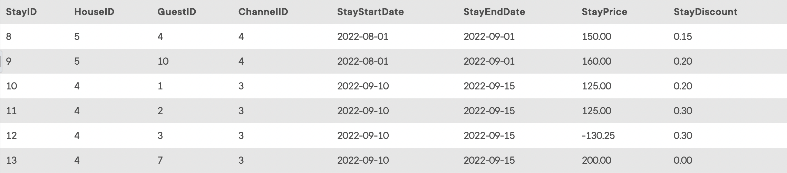

## Task 1:

The InstantStay Finance team require all the available information about the reservations where the commission rate of the channel is higher than 10%##

```mysql
SELECT
    *
FROM
    STAY
WHERE
    ChannelID IN (SELECT
            ChannelID
        FROM
            CHANNEL
        WHERE
            ChannelCommission > 0.1);
```

The statement first looks for all the channels with the commission rate higher than 0.1##Then, it uses the channels to check for the corresponding reservations in the `STAY` table:
<p align='center'>

</p>

<sup>_Stay information filtered by commission rate_</sup>
