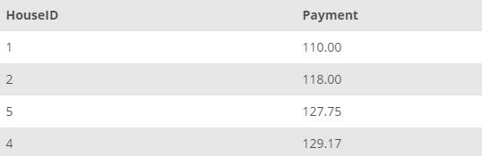

## Task 2:

The InstantStay Finance team requires average price per stay rounded to two decimal places for all the houses in the system. However, ensure that you do not include the cancelled stays with negative payment information.

```mysql
SELECT
    HouseID,
    ROUND(AVG(StayPrice * (1 - StayDiscount)), 2) AS Payment
FROM
    STAY
WHERE
    StayPrice > 0
GROUP BY HouseID;
```

The average price information sent to the InstantStay Finance team should resemble the example shown below:

<p align='center'>

</p>

<sup>_Average payment for house_</sup>
