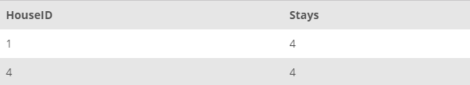

## Task 3:

The InstantStay Marketing team wants to learn the apartment that have more than average number of stays. Use the following script:

```mysql
SELECT
    HouseID, COUNT(StayID) AS Stays
FROM
    STAY
GROUP BY HouseID
HAVING COUNT(StayID) > (SELECT
        AVG(s.Stays)
    FROM
        (SELECT
            COUNT(StayID) AS Stays
        FROM
            STAY
        GROUP BY HouseID) AS s);

```

This statement first calculates the average number of stays for houses and uses this information to compare all other houses. Finally, it collects the HouseIDs and reservation counts for the corresponding apartments:
<p align='center'>

</p>

<sup>_Higher than average used houses_</sup>
