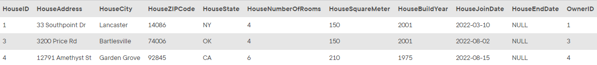

## Task 4:

The Marketing team wants to get all the houses in the system which are larger than the average in size. For the calculation, you will compare against the `AVG` of `HouseSquareMeter` for all the houses in InstantStay.

```mysql
SELECT
    *
FROM
    HOUSE
WHERE
    HouseSquareMeter >= (SELECT
            AVG(HouseSquareMeter)
        FROM
            HOUSE);
```

This statement returns the complete information about the houses larger than average:
<p align='center'>

</p>

<sup>_Houses larger than average_</sup>
