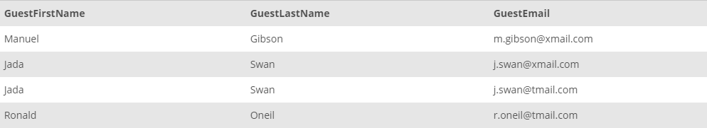

## Task 5:

The Marketing team wants to get the name and email information for all the guests which have been registered into the system so far though not stayed in any property yet. The team is planning to use the collected information to fill the email templates with first name, last name and email fields and then send the reminder emails.

```mysql
SELECT
    g.GuestFirstName, g.GuestLastName, g.GuestEmail
FROM
    GUEST g
WHERE
    g.GuestID != ALL (SELECT DISTINCT
            s.GuestID
        FROM
            STAY s);
```

This statement collects the guests where their IDs not mentioned in `STAY` table at all:
<p align='center'>

</p>

<sup>_Guests without reservation yet_</sup>
