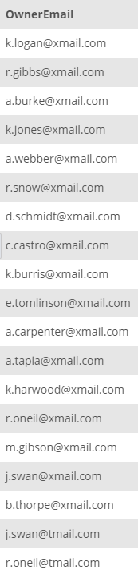

## Task 6:

The InstantStay Legal team wants to send new _General Data Protection Regulation (GDPR)_ emails who are registered in the system. Collect email information for all owners and guests.

```mysql
SELECT
    OwnerEmail
FROM
    OWNER
UNION SELECT
    GuestEmail
FROM
    GUEST;
```

Since the house owners and guests are in separate tables, the above statement will join and return all email addresses:

<p align='center'>

</p>

<sup>_Email address of all users_</sup>
