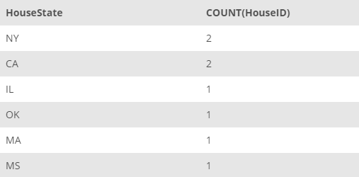

## Task 1:

The InstantStay House Development team works on the houses and the coverage of InstantStay over the world. They require a detailed analysis on the count of houses in the InstantStay. To start with, they require the count of houses based in each state in a descending order:

```mysql
SELECT
    HouseState, COUNT(HouseID)
FROM
    HOUSE
GROUP BY HouseState
ORDER BY COUNT(HouseID) DESC;
```

The above query returns the state and the number of houses located in the corresponding state in the descending order:

<p align='center'>

</p>

<sup>_Number of houses by state_</sup>
