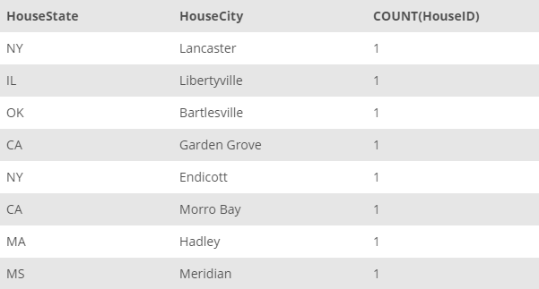

## Task 2:

In addition, House Development team wants the same information (as mentioned in the _Task 1_) along with the city, state level details:

```mysql
SELECT
    HouseState, HouseCity, COUNT(HouseID)
FROM
    HOUSE
GROUP BY HouseState, HouseCity
ORDER BY COUNT(HouseID) DESC;
```

This statement returns the number of houses collected by city and state level:

<p align='center'>

</p>

<sup>_Number of houses by state and city_</sup>
