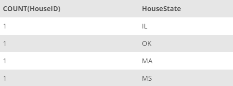

## Task 3:

The House Development team considers that having a limited availability of houses in a state could be risky and less beneficial for the business. For Example, The InstantStay will be unable to process the reservation requests if the request count is higher than count of registered houses in the state currently available to rent out. Therefore to take further steps to work on such issues, the team requires to know all the states having less than **2** properties registered in the system:

```mysql
SELECT
    COUNT(HouseID), HouseState
FROM
    HOUSE
GROUP BY HouseState
HAVING COUNT(HouseID) < 2
ORDER BY COUNT(HouseID) DESC;
```

The above query will collect the states with having less than **2** houses in the system:

<p align='center'>

</p>

<sup>_States with limited availability_</sup>
