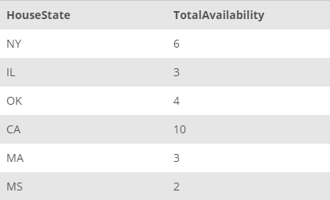

## Task 4:

The House Development team also requires to calculate the total number of rooms available in each state:

```mysql
SELECT
    HouseState, SUM(HouseNumberOfRooms) AS TotalAvailability
FROM
    HOUSE
GROUP BY HouseState;
```

The above SQL statement calculates the total availability as the sum of rooms for each state:

<p align='center'>

</p>

<sup>_States with total availability_</sup>
