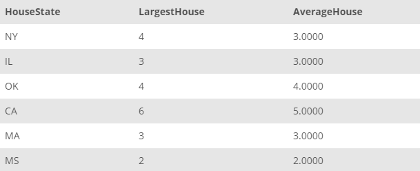

## Task 5:

In addition, the House Development team wants to know the largest and average house in terms of number of rooms for each state:

```mysql
SELECT
    HouseState,
    MAX(HouseNumberOfRooms) AS LargestHouse,
    AVG(HouseNumberOfRooms) AS AverageHouse
FROM
    HOUSE
GROUP BY HouseState;
```

The above SQL query will return the largest house and average house for each state:

<p align='center'>

</p>

<sup>_Average and largest houses by state_</sup>
