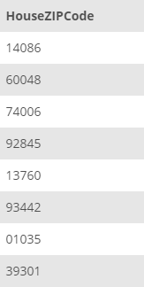
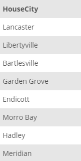

## Task 6:

The InstantStay Marketing team is planning to create some maps to show the coverage of InstantStay throughout the country. Therefore, they need some specific information such as distinct ZIP codes of all houses and distinct list of cities in two separate tables:

```mysql
SELECT DISTINCT
    HouseZIPCode
FROM
    HOUSE;
```

```mysql
SELECT DISTINCT
    HouseCity
FROM
    HOUSE;
```

This statement will return two tables, one for ZIP codes and other for cities:

<p align='center'>

</p> <p align='center'>

</p>

<sup>_Distinct ZIP codes and cities in two tables_</sup>
