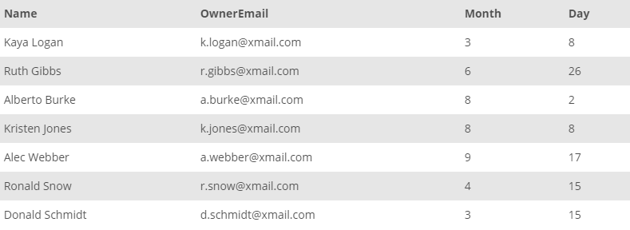

## Task 8:

The InstantStay Owner Relationships team focus on the success of InstantStay by creating strong connection to the owners. They want to send celebration mails to the owners on their joining date in the system.

They need the combined details which includes name and surname of the owners with their email addresses. In addition, they are planning to make this as practice for every year. The team requires the day and month of owners joining date to send emails on exact dates every year:

```mysql
SELECT
    CONCAT(OwnerFirstName, CONCAT(' ', OwnerLastName)) AS Name,
    OwnerEmail,
    MONTH(OwnerJoinDate) AS Month,
    DAY(OwnerJoinDate) AS Day
FROM
    OWNER;
```

The above SQL query summarized the required information for the celebration emails:

<p align='center'>

</p>

<sup>_Joint date and owner summary_</sup>
