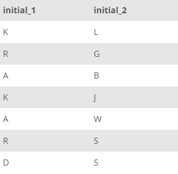

## Task 9:

The team wants to create a specialized carpets to the houses with the initials of owners. They wanted to get the uppercase first letter of firstname and surname of the owners:

```mysql
SELECT
    UPPER(SUBSTR(OwnerFirstName, 1, 1)) AS initial_1,
    UPPER(SUBSTR(OwnerLastName, 1, 1)) AS initial_2
FROM
    OWNER;
```

The output of the above query should resemble the example shown below:

<p align='center'>

</p>

<sup>_Initials of the owners_</sup>
