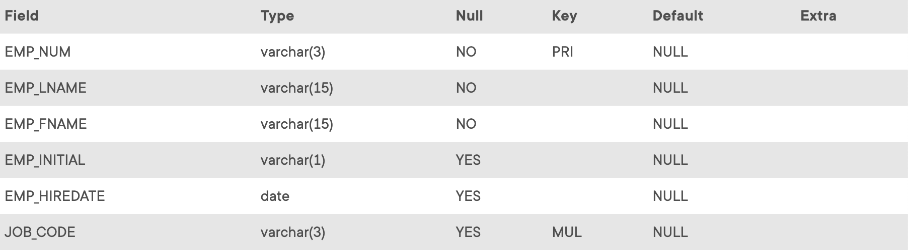

## Problem 1

Write the SQL code that will create only the table structure for a table named `EMP_1`. This table will be a subset of the `EMPLOYEE` table. The basic `EMP_1` table structure is summarized in the following table. Use `EMP_NUM` as the primary key. Note that the `JOB_CODE` is the `FK` to `JOB` so be certain to enforce referential integrity. Your code should also prevent null entries in `EMP_LNAME` and `EMP_FNAME`.

Table P8.1
