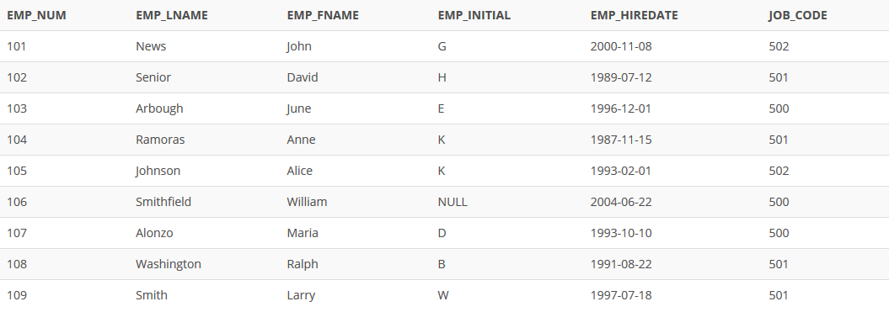

## Problem 2
Having created the table structure in *Problem 1*, write the SQL code to enter the first two rows for the table shown in *Figure P8.2*. Each row should be inserted individually, without using a subquery. Insert the rows in the order that they are listed in the figure.

Figure P8.2
