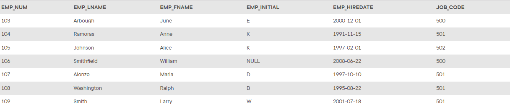

## Problem 3
Using the `EMPLOYEE` table that already exists, use a subquery to insert the remaining rows from the `EMPLOYEE` table into the `EMP_1` table. Remember, your subquery should only retrieve the columns needed for the `EMP_1` table and only the employees shown in the figure.

Figure P8.3
