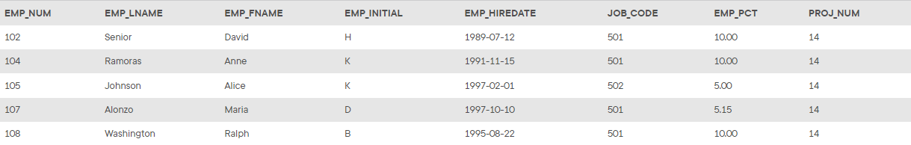

## Problem 15
Write the SQL code that will change the `PROJ_NUM` to 14 for employees who were hired before January 1, 1998, and whose job code is at least 501. When you finish *Problems 7–15*, the `EMP_2` table will contain the data shown in *Figure P8.15*.

Figure P8.15
