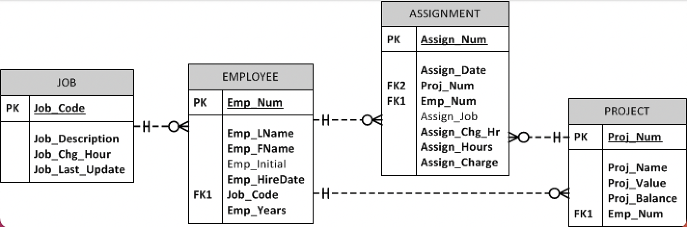
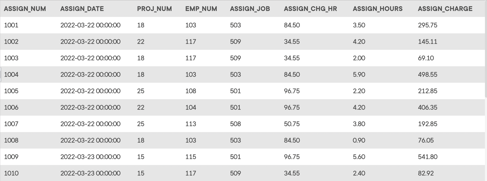
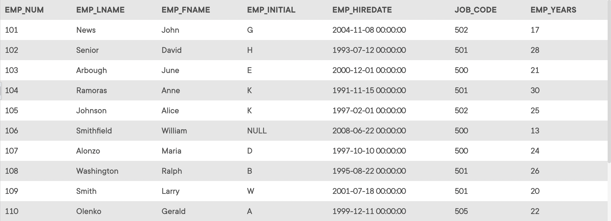
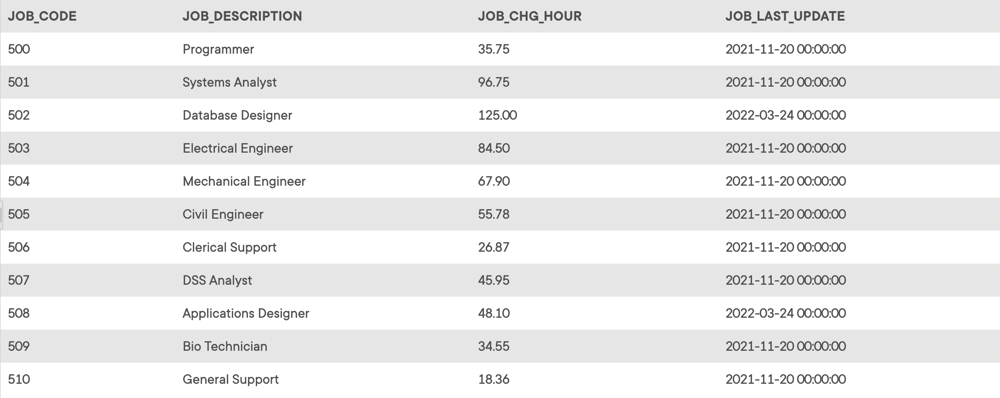
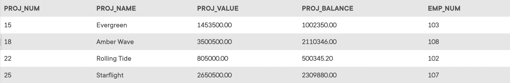

## Summary
The *Ch08_ConstructCo* database stores data for a consulting company that tracks all charges to projects. The charges are based on the hours each employee works on each project.  The structure and contents of the *Ch08_ConstructCo* database are shown below. Use this database to answer the following problems.

## Database Schema
The schema for the *Ch08_ConstructCo* database is shown below and should be used to answer the next several problems. Click this image to view it in its own tab.

*The `ASSIGNMENT` table*

*The `EMPLOYEE` table*

*The `JOB` table*

*The `PROJECT` table*

Note that the `ASSIGNMENT` table stores the `JOB_CHG_HOUR` values as an attribute (`ASSIGN_CHG_HR`) to maintain historical accuracy of the data. The `JOB_CHG_HOUR` values are likely to change over time. In fact, a` JOB_CHG_HOUR` change will be reflected in the `ASSIGNMENT` table. Naturally, the employee primary job assignment might also change, so the `ASSIGN_JOB` is also stored. Because those attributes are required to maintain the historical accuracy of the data, they are not redundant.

## Instructions
Given the structure of the *Ch08_ConstructCo* database shown above, use SQL commands to answer the problems in the following steps.

Write your SQL statement in the editor on the right, then click the **Run** button to execute your statement in the interactive MySQL shell.

Click **Next Step** to get started!