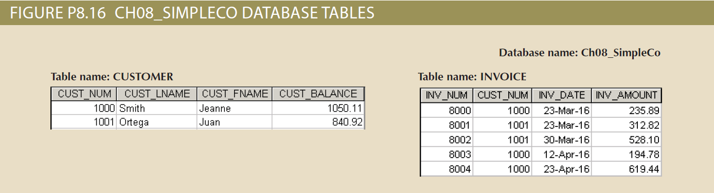

## Summary
The structure and contents of the *Ch08_SimpleCo* database are shown in *Figure P8.16*. Use this database to answer the following problems.

## Database Schema
The schema for the *Ch08_SimpleCo* database is shown below and should be used to answer the next several problems. Click this image to view it in its own tab.

## Instructions
Given the structure of the *Ch08_SimpleCo* database shown above, use SQL commands to answer the problems in the following steps.

Write your SQL statement in the editor on the right, then click the **Run** button to execute your statement in the interactive MySQL shell.

Click **Next Step** to get started!
