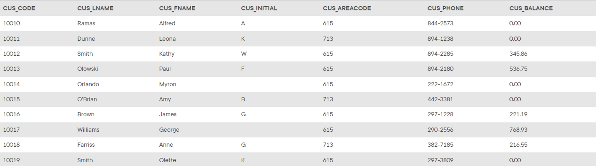
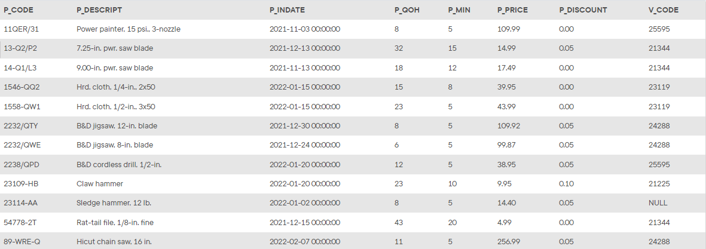
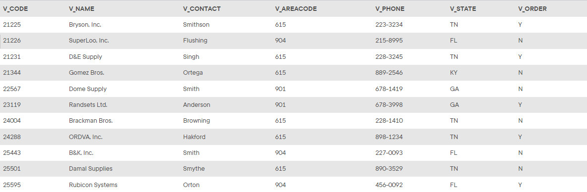
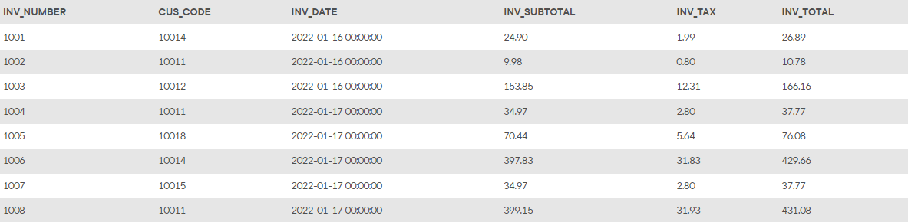
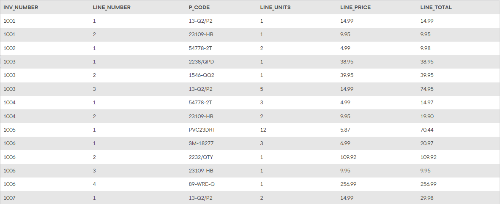

## Summary

The structure and contents of the *Ch08_SaleCo2* database are shown below. Use this database to answer problems 31 - 34.

## Database Schema

The schema for the *Ch08_SaleCo2* database is shown below and should be used to answer the next several problems. Click this image to view it in its own tab.

*The `CUSTOMER` table*

*The `PRODUCT` table*

*The `VENDOR` table*

*The `INVOICE` table*

*The `LINE` table*

## Instructions

Given the structure of the *Ch08_SaleCo2* database shown above, use SQL commands to answer the problems in the following steps.

Write your SQL statement in the editor on the right, then click the **Run** button to execute your statement in the interactive MySQL shell.

Click **Next Step** to get started!
