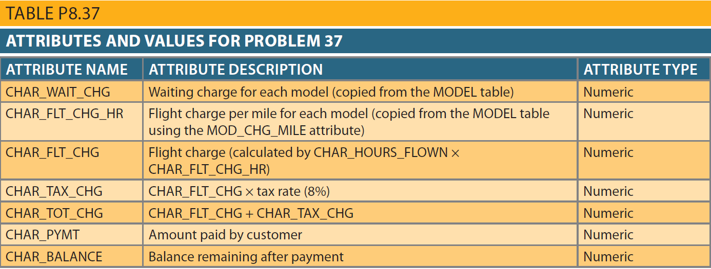

## Problem 37
Modify the `CHARTER` table to add the attributes shown in the following table.

Use the following precision for each row:

| Attribute Name| Attribute Precision |
| -------- | -------- |
| CHAR_WAIT_CHG| 6,2|
|CHAR_FLT_CHG_HR|6,2|
|CHAR_FLT_CHG|10,2|
|CHAR_TAX_CHG|6,2|
|CHAR_TOT_CHG|10,2|
|CHAR_PYMT|10,2|
|CHAR_BALANCE|10,2|

