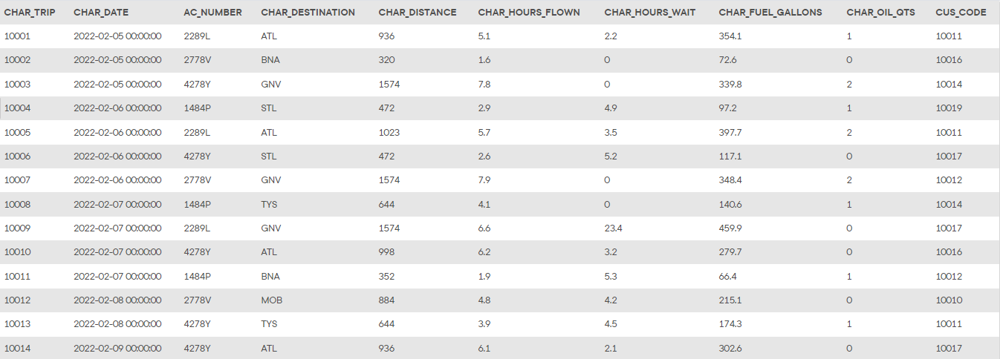
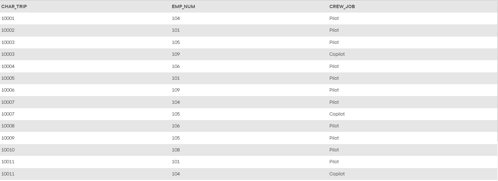
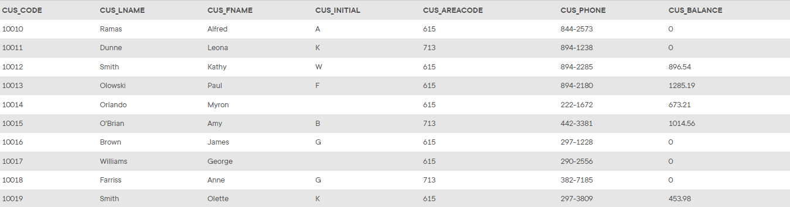
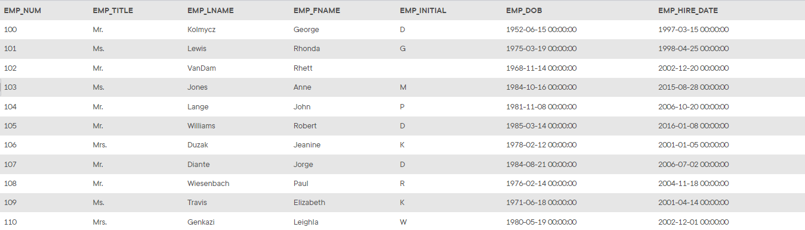
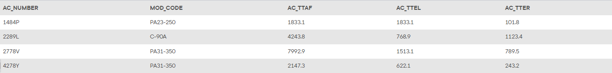
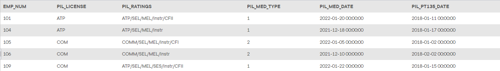
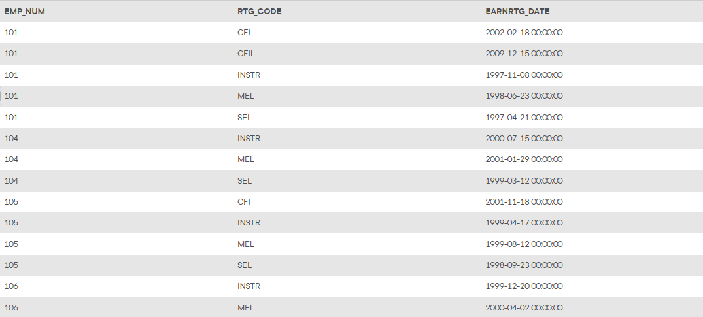
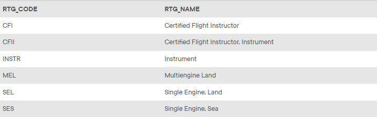
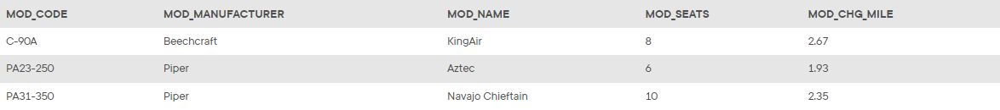

## Summary

The structure and contents of the *Ch08_AviaCo* database are shown below. Use this database to answer problems 35 - 46.

## Database Schema

The schema for the *Ch08_AviaCo* database is shown below and should be used to answer the next several problems. Click this image to view it in its own tab.

*The `CHARTER` table*

*The `CREW` table*

*The `CUSTOMER` table*

*The `EMPLOYEE` table*

*The `AIRCRAFT` table*

*The `PILOT` table*

*The `EARNEDRATING` table*

*The `RATING` table*

*The `MODEL` table*

## Instructions

Given the structure of the *Ch08_AviaCo* database shown above, use SQL commands to answer the problems in the following steps.

Write your SQL statement in the editor on the right, then click the **Run** button to execute your statement in the interactive MySQL shell.

Click **Next Step** to get started!
