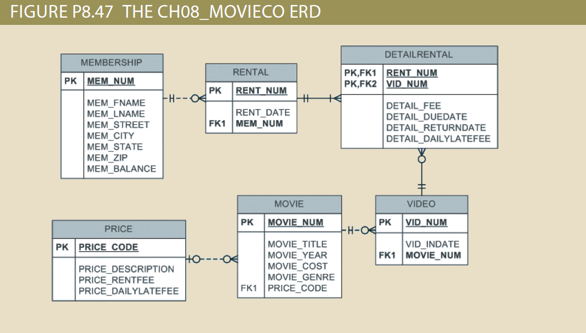

## Problem 47

Write the SQL code to create the table structures for the entities shown in *Figure P8.47*. The structures should contain the attributes specified in the ERD. Use data types that are appropriate for the data that will need to be stored in each attribute. For testing, use `DECIMAL` instead of `NUMERIC`. Enforce primary key and foreign key constraints as indicated by the ERD.

Require data meet the following criteria:

| Table | Column|Precision and Scale | Other
| -------- | -------- | -------- |--------|
| `PRICE`     | `PRICE_CODE`     |2,0|-|
| `PRICE`     | `PRICE_DESCRIPTION`     |20|NOT `NULL`|
| `PRICE`     | `PRICE_RENTFEE`     |5,2| `>=0` |
| `PRICE`     | `PRICE_DAILYLATEFEE`     |5,2| `>=0` |
| -------- | -------- | -------- |--------|
| `MOVIE`     | `MOVIE_NUM`     |8,0|-|
| `MOVIE`     | `MOVIE_TITLE`     |75|NOT `NULL`|
| `MOVIE`     | `MOVIE_YEAR`     |4,0| `>1990`|
| `MOVIE`     | `MOVIE_COST`     |5,2|-|
| `MOVIE`     | `MOVIE_GENRE`     |50|-|
| `MOVIE`     | `PRICE_CODE`     |2,0|-|
| -------- | -------- | -------- |--------|
| `VIDEO`| `VID_NUM`|8,0|-|
| `VIDEO`| `VID_INDATE`|-|`DATE`|
| `VIDEO`| `MOVIENUM`|8,0|-|
| -------- | -------- | -------- |--------|
| `MEMBERSHIP`| `MEM_NUM`|8,0|-|
| `MEMBERSHIP`| `MEM_FNAME`|30|NOT `NULL`|
| `MEMBERSHIP`| `MEM_LNAME`|30|NOT `NULL`|
| `MEMBERSHIP`| `MEM_STREET`|120|-|
| `MEMBERSHIP`| `MEM_CITY`|50|-|
| `MEMBERSHIP`| `MEM_STATE`|2|-|
| `MEMBERSHIP`| `MEM_ZIP`|5|-|
| `MEMBERSHIP`| `MEM_BALANCE`|10,2|-|
| -------- | -------- | -------- |--------|
| `RENTAL`| `RENT_NUM`|8,0|-|
| `RENTAL`| `RENT_DATE`|-|`DATETIME`|
| `RENTAL`| `MEM_NUM`|8,0|-|
| -------- | -------- | -------- |--------|
| `DETAILRENTAL`| `RENT_NUM`|8,0|-|
| `DETAILRENTAL`| `VID_NUM`|8,0|-|
| `DETAILRENTAL`| `DETAIL_FEE`|5,2|-|
| `DETAILRENTAL`| `DETAIL_DUEDATE`|-|`DATE`|
| `DETAILRENTAL`| `DETAIL_RETURNDATE`|-|`DATE`|
| `DETAILRENTAL`| `DETAIL_DAILYLATEFEE`|5,2|-|

