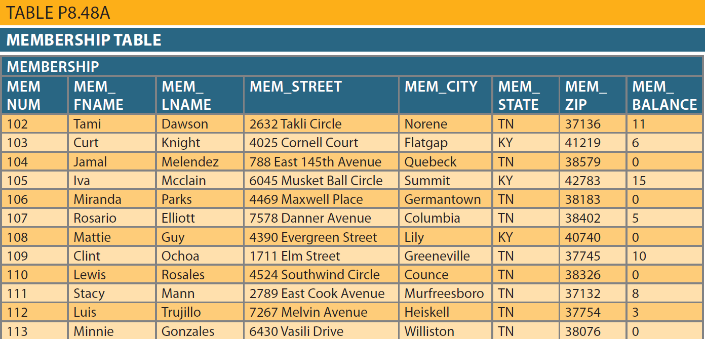
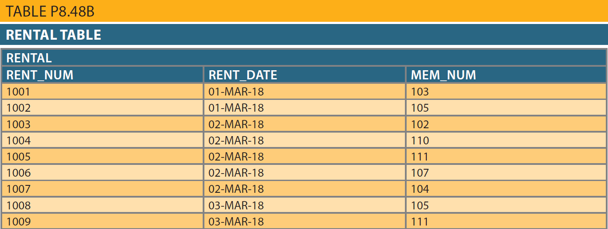
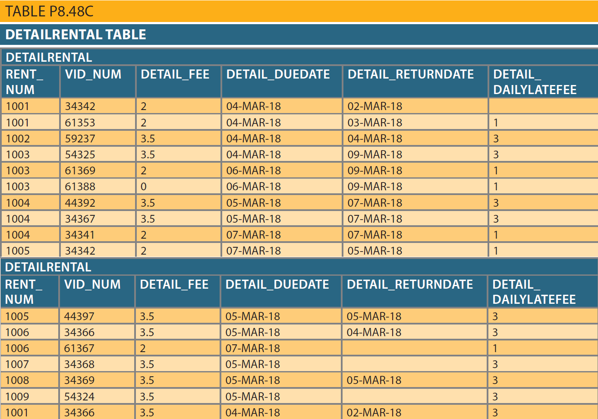

## Problem 48
The following tables provide a very small portion of the data that will be kept in the database. The data needs to be inserted into the database for testing purposes. Write the `INSERT` commands necessary to place the following data in the tables that were created in *Problem 47*. (If required by your DBMS, be certain to save the rows permanently.)

>Use YYYY-MM-DD format when inserting dates.

