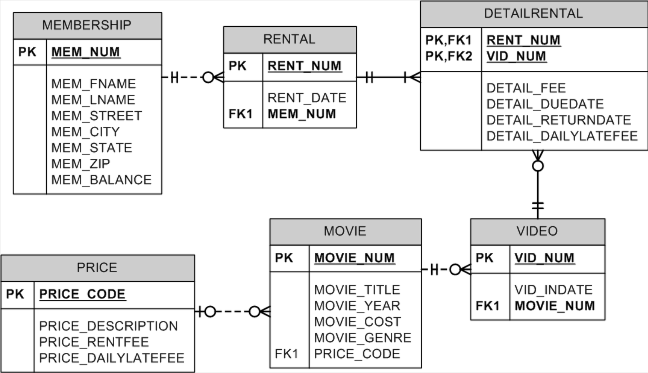

## Summary

EliteVideo is a startup company providing concierge DVD kiosk service in upscale neighborhoods. EliteVideo can own several copies (`VIDEO`) of each movie (`MOVIE`). For example, a kiosk may have 10 copies of the movie *Twist in the Wind*. In the database, *Twist in the Wind* would be one `MOVIE`, and each copy would be a `VIDEO`. A rental transaction (`RENTAL`) involves one or more videos being rented to a member (`MEMBERSHIP`). A video can be rented many times over its lifetime; therefore, there is an M:N relationship between `RENTAL` and `VIDEO`. `DETAILRENTAL` is the bridge table to resolve this relationship. 

The structure and contents of the *Ch08_MovieCo * database are shown below. Use this database to answer problems 47 - 48.

## Database Schema

The schema for the *Ch08_MovieCo * database is shown below and should be used to answer the next several problems. Click this image to view it in its own tab.

*The flowchart*

## Instructions

Given the structure of the *Ch08_MovieCo * database shown above, use SQL commands to answer the problems in the following steps.

Write your SQL statement in the editor on the right, then click the **Run** button to execute your statement in the interactive MySQL shell.

Click **Next Step** to get started!
