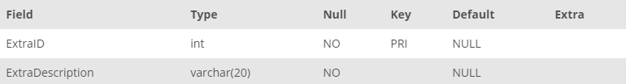

## Task 1:

The InstantStay House Development team wants to track the extra facilities and/or benefits such as amenities or insurances, provided with the houses. The team needs you to create a new database table called **EXTRA** with fields **ExtraID** and ExtraDescription##

```mysql
CREATE TABLE EXTRA (
    ExtraID INT PRIMARY KEY NOT NULL,
    ExtraDescription VARCHAR(20) NOT NULL
);
```

This statement creates a table with two columns, and it can be shown with the command
`DESCRIBE EXTRA;`:

<p align='center'>

</p>

<sup>_EXTRA table_</sup>
