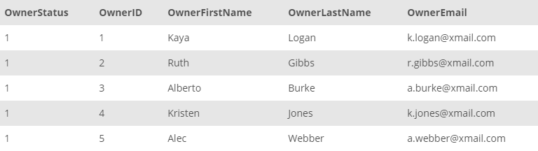

## Task 3:

The Owner Relationships team wants to track the active owners in the InstantStay system. The team requested a new table, called ACTIVE_OWNER##which should have all the related information of the active owners currently:

```mysql
CREATE TABLE ACTIVE_OWNER (
    OwnerID INT NOT NULL,
    OwnerFirstName VARCHAR(50) NOT NULL,
    OwnerLastName VARCHAR(50) NOT NULL,
    OwnerStatus BOOL DEFAULT TRUE,
    OwnerEmail VARCHAR(50) NOT NULL
) AS SELECT OwnerID, OwnerFirstName, OwnerLastName, OwnerEmail FROM
    OWNER
WHERE
    OwnerEndDate IS NULL;
```

The above statement creates a new `ACTIVE_OWNER` table with the data collected from `OWNER` table where the `OwnerEndDate` is `NULL`. You can check for its content with the command `SELECT * FROM ACTIVE_OWNER;`. All owners with their ID, name, email and status values are available in the new table:

<p align='center'>

</p>

<sup>_ACTIVE_OWNER table_</sup>
