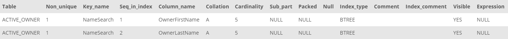

## Task 4:

The owner relationship team wants to reduce the time required to access all the active owner details. The team has highlighted the fact that it needs extra effort and time to fetch the customer information when they are only provided with the first name. The team is looking for a solution to minimize the time required to fetch the required data.

In such case, you need to create an `INDEX` for first name and last name of the active owners. Indexes make it easier to find rows in MySQL. Without an index, the MySQL engine will look for all the rows to find the searched items. Indexes are created over the tables and their fields:

```mysql
CREATE INDEX NameSearch ON ACTIVE_OWNER(OwnerFirstName, OwnerLastName);
```

The above statement creates an index on the `ACTIVE_OWNER` table. All indexes can be listed with the command:

```mysql
SHOW INDEX FROM ACTIVE_OWNER;
```

<p align='center'>

</p>

<sup>_Index list_</sup>
