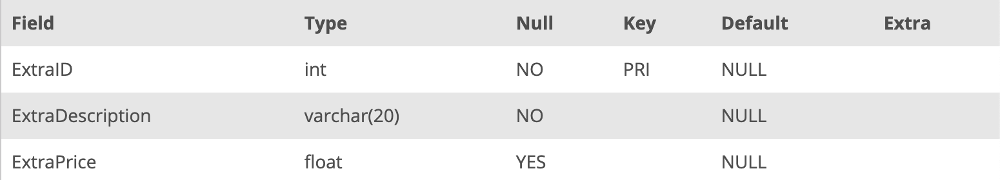

## Task 6:

The House Development team considered that the extras for the houses should not be free. Therefore, they want to extend their `EXTRA` table to cover pricing information. Change the corresponding table with the following command:

```mysql
ALTER TABLE EXTRA
ADD COLUMN ExtraPrice FLOAT;
```

The above statement adds a new column to the table and it can be checked with the command:

```mysql
DESCRIBE EXTRA;
```

The `ExtraPrice` column with default value of `NULL` is added to the `EXTRA` table:

<p align='center'>

</p>

<sup>_Altered EXTRA table_</sup>
