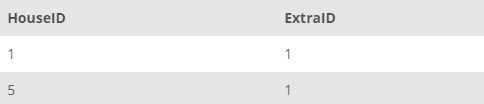

## Task 4:

The House Development team mentioned that all the houses in the state NY already have Liability Insurance (ID: 1). Add all the houses in NY with the `ExtraID` value of **1** into the `HOUSE_EXTRA` table:

```mysql
INSERT INTO HOUSE_EXTRA(HouseID, ExtraID)
SELECT HouseID, '1' FROM HOUSE WHERE HouseState = 'NY';
```

You should expect to see some houses have been added to the `HOUSE_EXTRA` table when it is checked with the command `SELECT * FROM HOUSE_EXTRA;` :

<p align='center'>

</p>

<sup>_Houses with extras_</sup>
