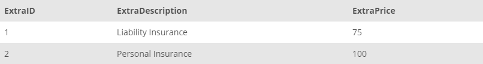

## Task 6:

The House Development team wants to update the price of the liability insurance extra to **75** and wants to remove the household insurance option. However, the team does not store the `ExtraID` and wants to work with the `ExtraDescription`. Prepare the update script by temporarily inactivating the safe update feature of MySQL:

```mysql
SET SQL_SAFE_UPDATES = 0; -- temporarily inactivating the safe update feature of MySQL

UPDATE EXTRA
SET
    ExtraPrice = 75
WHERE
    ExtraDescription = 'Liability Insurance';
DELETE FROM EXTRA
WHERE
    ExtraDescription = 'Household Insurance';
SET SQL_SAFE_UPDATES = 1; -- activating the safe update feature of MYSQL
```

The above statement first disables the safe update feature of MySQL and then runs the update command. After that, the delete command is executed and finally safe updates are enabled back. After these executions, verify the `EXTRA` table using the `SELECT * FROM EXTRA;` command:

<p align='center'>

</p>

<sup>_Updated EXTRA table_</sup>
