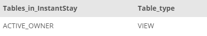

## Task 4:

The Owner Relationship team requested to work with a `VIEW` for active owners. Create a `VIEW` with the name **ACTIVE_OWNER** from the table `OWNER` for the owners with end date is NULL##

```mysql
CREATE VIEW ACTIVE_OWNER AS
    SELECT
        OwnerID, OwnerFirstName, OwnerLastName, OwnerEmail
    FROM
        OWNER
    WHERE
        OwnerEndDate IS NULL;
```

`VIEWS` in the database can be listed with `SHOW FULL TABLES WHERE table_type = 'VIEW';` command:

<p align='center'>

</p>

<sup>_ACTIVE_OWNER VIEW_</sup>
