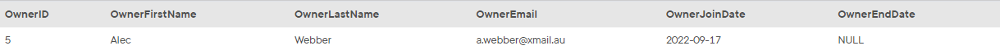

## Task 5:

The Owner Relationship team wants to update the email of the active owner whose ID is **5** with the address a\.webber@xmail\.au##Create an `UPDATE` statement to work over the `ACTIVE_OWNER` view:

```mysql
UPDATE ACTIVE_OWNER
SET
    OwnerEmail = 'a.webber@xmail.au'
WHERE
    OwnerID = 5;
```

The above statement executes an update over the `ACTIVE_OWNER` `VIEW`. The change can be also checked from the original `OWNER` table with the command:

```mysql
SELECT * FROM OWNER WHERE OwnerID = 5;
```

The email field of the row shows that the `UPDATE` over the `VIEW` works as expected:

<p align='center'>

</p>

<sup>_Data from the OWNER table_</sup>
