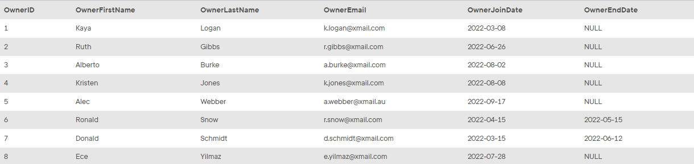

## Task 6:

The Owner Relationship team wants to add a new owner (Ece, Yilmaz, e.yilmaz@xmail.com, 2022-07-28## However, they indicated that `OwnerID` fields should be automatically increased with the new additions to the system. You need to make related adjustment to the `OWNER` table for the `OwnerID` field:

```mysql
ALTER TABLE OWNER CHANGE OwnerID OwnerID INT AUTO_INCREMENT;
```

Then, you can add the new owner without specifying the OwnerID field:

```mysql
INSERT INTO OWNER(OwnerFirstName, OwnerLastName, OwnerEmail,OwnerJoinDate) VALUES('Ece', 'Yilmaz', 'e.yilmaz@xmail.com','2022-07-28');
```

Verify the new owner has an auto incremented ID with the command `SELECT * FROM OWNER;`:

<p align='center'>

</p>

<sup>_Auto incremented ID_</sup>
