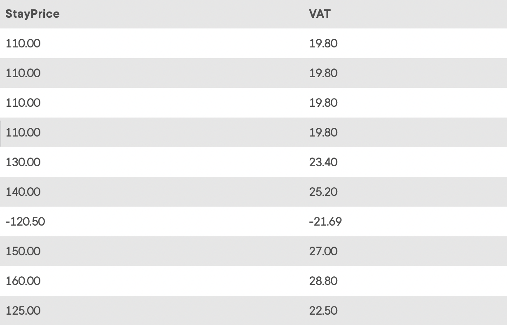

## Task 1:

The InstantStay Finance team requested a procedure to calculate the value-added tax (VAT) amount of the stays reservations in InstantStay. The team also indicated that VAT percentage is currently 18% but can be changed in the future. You need to create a VATCalculator procedure with the VAT Percentage variable. We will create the procedure with a single `SELECT` statement where the price and VAT is calculated:

```mysql
DELIMITER $$
CREATE PROCEDURE VATCalculator()
BEGIN
DECLARE VAT_PERCENTAGE FLOAT DEFAULT 0.18;
SELECT StayPrice, ROUND(StayPrice * VAT_PERCENTAGE,2) AS VAT FROM STAY;
END $$
DELIMITER ;
```

The above procedure declares `VAT_PERCENTAGE` and uses it in the `SELECT` statement. You can call the procedure and check the output with the command `CALL VATCalculator();`:

<p align='center'>

</p>

<sup>_VAT calculation_</sup>
