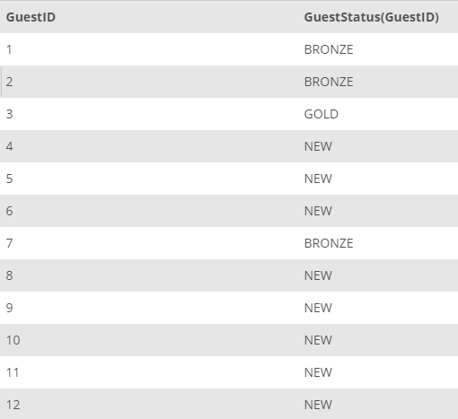

## Task 2:

The InstantStay Marketing team wants to create guest levels such as **GOLD**, **BRONZE**, and **NEW** The team will use these levels to provide additional campaigns and discounts. The team requested to create a function to set guest level as **GOLD** when the user stays more than **2**, **BRONZE** more than **1** and **NEW** otherwise. Create the following MySQL function to return the guest levels:

```mysql
DELIMITER $$
CREATE FUNCTION GuestStatus(
    id INT
)
RETURNS VARCHAR(20)
DETERMINISTIC
BEGIN
    DECLARE guestLevel VARCHAR(20);
    DECLARE stayCount INT;
    SET stayCount = (SELECT COUNT(StayID) FROM STAY WHERE GuestID=id GROUP BY GuestID);

    IF ( stayCount > 2) THEN
        SET guestLevel = 'GOLD';
    ELSEIF (stayCount > 1) THEN
        SET guestLevel = 'BRONZE';
    ELSE
        SET guestLevel = 'NEW';
    END IF;
    RETURN (guestLevel);
END$$
DELIMITER ;
```

The `GuestStatus` function takes the id as input and returns the level as a `VARCHAR`. Inside the function, count of the user stay data is checked for the level assignment. The function can be called within a `SELECT` statement as shown below:

```mysql
SELECT
    GuestID, GuestStatus(GuestID)
FROM
    GUEST;
```

The results are as follows:

<p align='center'>

</p>

<sup>_Guest levels_</sup>
