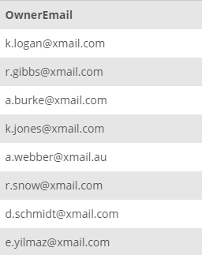

## Task 3:

The InstantStay Developers team requested a SQL statement to collect the emails from the tables in the InstantStay database. Create a generic statement with the following script and execute it for testing:

```mysql
SET @table_name:='OWNER';
SET @OwnerEmailCollector:=CONCAT('SELECT OwnerEmail FROM ',@table_name);
PREPARE Statement FROM @OwnerEmailCollector;
EXECUTE Statement;
```

In the first variable, a table name is set and in the second variable the actual statement is created. The `PREPARE` statement combines the variables and it is finally run with the `EXECUTE` statement:

<p align='center'>

</p>

<sup>_Collecting emails_</sup>
