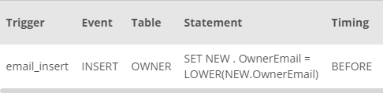

## Task 4:

The Developers team wanted to ensure that all the emails of the owners are lowercase in the database. You need to create a trigger for before any `INSERT` statement on `OWNER` table:

```mysql
CREATE
    TRIGGER  email_insert
 BEFORE INSERT ON OWNER FOR EACH ROW
    SET NEW . OwnerEmail = LOWER(NEW.OwnerEmail);
```

You can list the triggers on the database with the `SHOW TRIGGERS;` command:

<p align='center'>

</p>

<sup>_InstantStay triggers_</sup>
