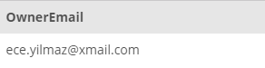

## Task 5:

The Developers also indicated that emails should be lowercase even after they are updated in the database. You need to create another trigger for before any `UPDATE` statements are called on the `OWNER` table:

```mysql
CREATE
    TRIGGER  email_update
 BEFORE UPDATE ON OWNER FOR EACH ROW
    SET NEW . OwnerEmail = LOWER(NEW.OwnerEmail);
```

You can test the trigger with the following update:

```mysql
UPDATE OWNER
SET
    OwnerEmail = 'ECE.YILMAZ@XMAIL.COM'
WHERE
    OwnerID = 8;
```

Let's check the email of the user:

```mysql
SELECT
    OwnerEmail
FROM
    OWNER
WHERE
    OwnerID = 8;
```

As expected, the trigger made the email of the user lowercase in the database:

<p align='center'>

</p>

<sup>_Trigger on email updates_</sup>
