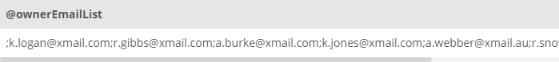

## Task 6:

The Marketing team requested to create an email list with combining all the email addresses with `;`. You need to create a procedure that uses a `CURSOR` to iterate all over the emails in the `OWNER` table:

```mysql
DELIMITER $$
CREATE PROCEDURE OwnerEmailList (
    INOUT emailAddresses varchar(10000)
)
BEGIN
    DECLARE finished INTEGER DEFAULT 0;
    DECLARE emailAddress varchar(100) DEFAULT "";

    DECLARE cursorEmail CURSOR FOR SELECT OwnerEmail FROM OWNER;
    DECLARE CONTINUE HANDLER FOR NOT FOUND SET finished = 1;

    OPEN cursorEmail;
    collect: LOOP
        FETCH cursorEmail INTO emailAddress;
        IF finished = 1 THEN
            LEAVE collect;
        END IF;
        SET emailAddresses = CONCAT(emailAddresses,";",emailAddress);
    END LOOP collect;
    CLOSE cursorEmail;

END$$
DELIMITER ;
```

Run the procedure and set the output to the `ownerEmailList` variable:

```mysql
SET @ownerEmailList = "";
CALL OwnerEmailList(@ownerEmailList);
SELECT @ownerEmailList;
```

You will get a long list of emails combined with `;`:

<p align='center'>

</p>

<sup>_Email procedure results_</sup>
