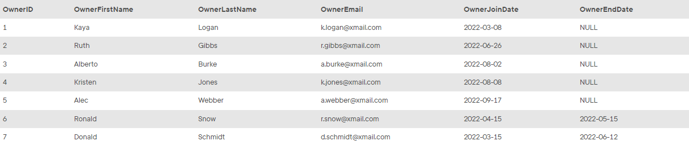
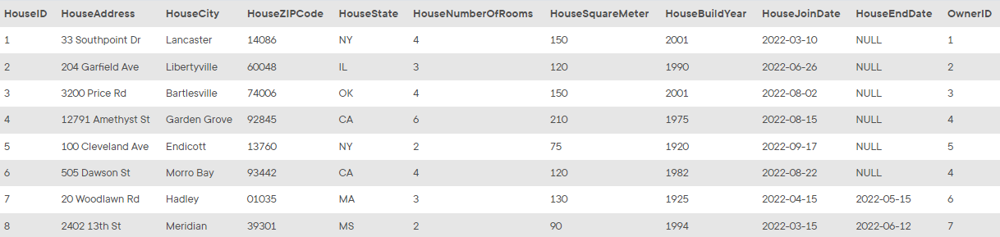
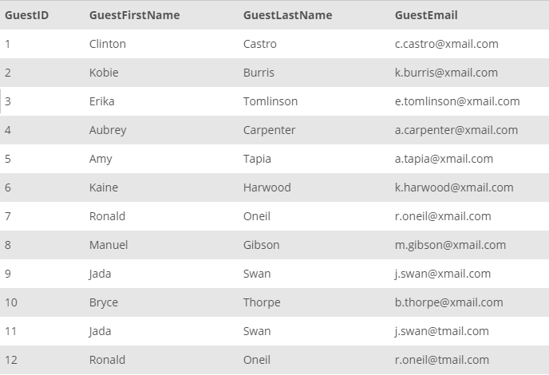
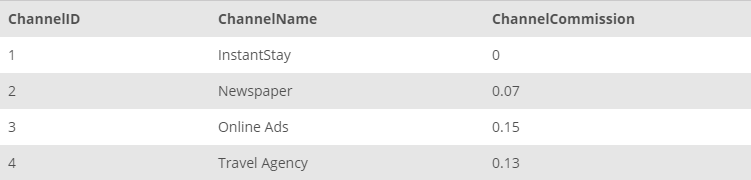
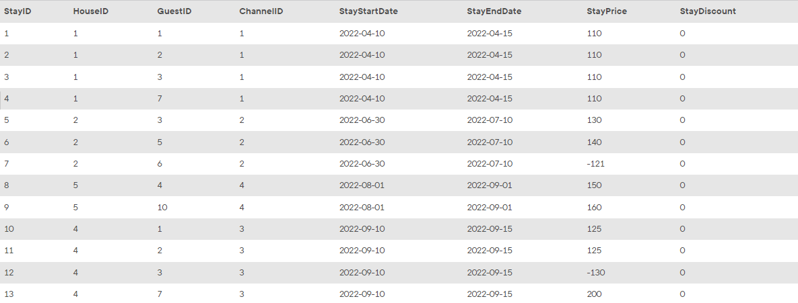

<!-- practice -->

# Scenario and Database Model: InstantStay

**InstantStay** is the new online marketplace to find accommodation in various cities and states. It focuses on gathering the house owners and tenants together as a trusted platform. Hosts join to the system with their houses to be rented out. Similarly, guests join to the system to rent available houses. In addition, channels such as travel agencies, newspapers join InstantStay for connecting customers from different platforms.

In the `OWNER` table, data for the house owners are collected with their personal information as shown in the following table:

_OWNER Table_

In the `HOUSE` table, all houses in InstantStay are collected with detailed address and respective characteristics about the houses:

_HOUSE Table_

Guests are the customers registered to the platform to access information, offers and stay at houses in InstantStay. Data of the guests are collected in the `GUEST` table:

_GUEST Table_

As a large platform, InstantStay hosts multiple channels with different commission rates. The channels related information is collected in the `CHANNEL` table:

_CHANNEL Table_

Finally, each reservation in the system is collected in `STAY` table. Reservations are collected with the corresponding house, guest and channel, start date, and end date. The price information with discount are also tracked in this table. Negative prices indicate the cancellations and the required repayments. Collected data for reservations are as follows:

_STAY Table_

You are assigned as the database administrator to collect and manage transactional data of the InstantStay operations. Your main task is to create SQL scripts to help other teams in InstantStay to retrieve the required data. In the following tasks, you will collect the requested data to help other teams be successful on their business operations.
